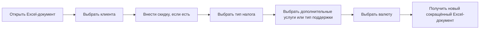

# UX: подготовка расчёта коммерческого предложения

## Результаты UX-интервью

| Вопрос | Ответ |
| --- | --- |
| Кто основной пользователь? | Аккаунт-менеджер. |
| В какой ситуации он использует продукт? | При расчёте стоимости проекта для коммерческого предложения. |
| Какая у него проблема? | Расчёт занимает много времени. Данные берутся из разных источников, и при переносе данных могут возникать ошибки. |
| Какая задача пользователя? | Быстро и качественно рассчитать коммерческое предложение в одном пространстве. |
| Какой наблюдаемый результат нужен? | Качественный и точный расчёт стоимости проекта в виде отдельного документа без лишней информации. |
| Какая точка входа? | Excel. |
| Какой успешный выход? | Новый сокращённый Excel-документ без лишних модулей. |

## Путь пользователя

1. Открывает Excel-документ.
2. Выбирает клиента.
3. Вносит скидку, если она есть.
4. Выбирает тип налога.
5. Выбирает дополнительные услуги или тип поддержки.
6. Выбирает валюту.
7. Получает новый сокращённый Excel-документ без лишних модулей.

## Экраны

### 1. Исходный Excel-документ

Экран, с которого аккаунт-менеджер начинает расчёт. На нём пользователь:

- выбирает клиента;
- вносит скидку, если она есть;
- выбирает тип налога;
- выбирает дополнительные услуги или тип поддержки;
- выбирает валюту.

### 2. Новый сокращённый Excel-документ

Итоговый экран работы. Он содержит качественный и точный расчёт стоимости проекта без лишней информации и лишних модулей.

## Состояния экранов

### Исходный Excel-документ

- Документ открыт, выбор ещё не сделан.
- Клиент выбран.
- Скидка внесена, если она есть.
- Тип налога выбран.
- Дополнительные услуги или тип поддержки выбраны.
- Валюта выбрана.

### Новый сокращённый Excel-документ

- Документ создан.
- В документе нет лишней информации и лишних модулей.
- В документе представлен итоговый расчёт стоимости проекта.

Состояния загрузки и ошибок в интервью не определены.
